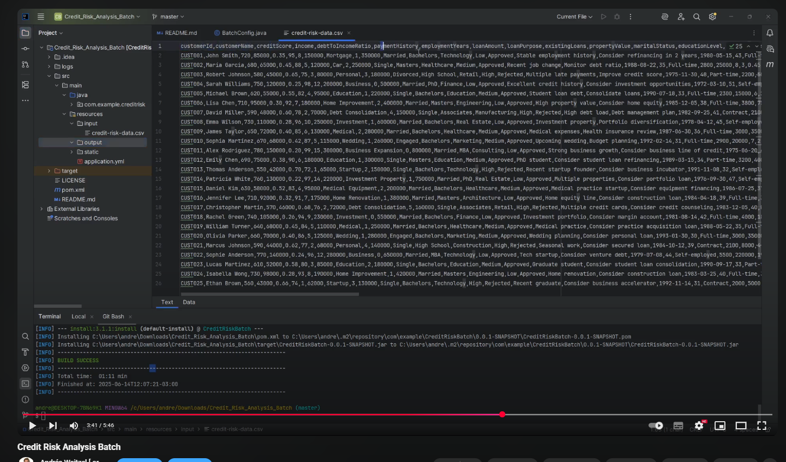

<div align = "center">
  
</div>

<div align="right">
    
    
    
    
    
     
        
</div>

<br>

<br>


<div align="right"> 
  <a href="./README.es.md">
    
  </a> 
  <a href="../../../../../README.md">
    
  </a> 
</div>

<br>

<br>

<div align="center">

# Credit Risk Analysis Batch 

</div>

Esta aplicación Spring Batch está diseñada para analizar y evaluar el riesgo crediticio de clientes utilizando un sistema sofisticado de puntuación multifactorial. El sistema procesa datos de clientes desde un archivo CSV, realiza un análisis de riesgo detallado y genera resultados tanto en una base de datos H2 como en un archivo CSV de salida.

* [Video Pruebas Funcionales](https://www.youtube.com/watch?v=9IEHzHfXZbo) <a href="https://www.youtube.com/watch?v=9IEHzHfXZbo" target="_blank"> </a>


## Secciones

<details>
<summary>1. Características Principales</summary>

### 1.1 Análisis de Riesgo Multifactorial
- **Puntuación Base de Crédito**: Normalización y ponderación del puntaje de crédito
- **Factores de Riesgo**:
  - Factor de Ingresos
  - Factor de Ratio Deuda-Ingreso
  - Factor de Historial de Pagos
- **Cálculo de Probabilidad de Incumplimiento**: Utilizando función sigmoide
- **Categorización de Riesgo**: LOW, MEDIUM, HIGH, VERY_HIGH

### 1.2 Sistema de Recomendaciones
- Límites de crédito sugeridos
- Tasas de interés recomendadas
- Términos de crédito
- Recomendaciones específicas por factor de riesgo

### 1.3 Procesamiento por Lotes
- Lectura de datos desde CSV
- Procesamiento en chunks configurables
- Escritura en base de datos y archivo CSV
- Manejo de errores y reintentos

### 1.4 Monitoreo y Métricas
- Endpoints de Actuator para monitoreo
- Integración con Prometheus
- Logging detallado
- Métricas de rendimiento
</details>

<details>
<summary>2. Requisitos Técnicos y Estructura</summary>

### 2.1 Requisitos Técnicos
- Java 17 o superior
- Maven 3.6 o superior
- Spring Boot 3.x
- Spring Batch 5.x
- H2 Database
- Caffeine Cache

### 2.2 Estructura del Proyecto
```
src/main/java/com/example/creditrisk/
├── config/
│   └── BatchConfig.java         # Configuración del batch job
├── model/
│   └── CreditRiskData.java      # Modelo de datos
├── processor/
│   └── CreditRiskProcessor.java # Procesador de riesgo
├── reader/
│   └── CreditRiskItemReader.java # Lector de datos
├── service/
│   └── RiskAnalysisService.java # Servicio de análisis de riesgo
├── writer/
│   └── CreditRiskFileWriter.java # Escritor de resultados
└── CreditRiskBatchApplication.java
```
</details>

<details>
<summary>3. Configuración y Ejecución</summary>

### 3.1 Configuración

### 3.2 Ejecución

1. Clonar el repositorio:
```bash
git clone [url-del-repositorio]
cd credit-risk-batch
```

2. Compilar el proyecto:
```bash
mvn clean install
```

3. Ejecutar la aplicación:
```bash
mvn spring-boot:run
```
</details>

<details>
<summary>4. Formato de Datos y Ejemplos</summary>

### 4.1 Formato de Datos de Entrada

El archivo de entrada debe estar en formato CSV con las siguientes columnas:

#### Información Básica del Cliente
- customerId: Identificador único del cliente
- customerName: Nombre del cliente
- birthDate: Fecha de nacimiento (YYYY-MM-DD)
- age: Edad del cliente
- maritalStatus: Estado civil (SINGLE, MARRIED, DIVORCED)
- educationLevel: Nivel educativo (HIGH_SCHOOL, BACHELORS, MASTERS, DOCTORATE)

#### Información Financiera
- creditScore: Puntaje de crédito (0-850)
- income: Ingresos anuales
- debtToIncomeRatio: Ratio deuda-ingreso (%)
- monthlyExpenses: Gastos mensuales
- savingsBalance: Saldo de ahorros
- propertyValue: Valor de propiedades (si aplica)

#### Información Laboral
- employmentType: Tipo de empleo (FULL_TIME, PART_TIME)
- employmentYears: Años de empleo
- industry: Industria/ Sector

#### Historial Crediticio
- paymentHistory: Historial de pagos (0-100)
- creditHistoryYears: Años de historial crediticio
- numberOfCreditCards: Número de tarjetas de crédito
- creditCardUtilization: Utilización de tarjetas de crédito (%)
- hasBankruptcy: Indicador de quiebra
- bankruptcyYearsAgo: Años desde la quiebra (si aplica)
- hasForeclosure: Indicador de embargo
- foreclosureYearsAgo: Años desde el embargo (si aplica)

#### Información de la Solicitud
- loanAmount: Monto del préstamo
- loanPurpose: Propósito del préstamo (MORTGAGE, CAR, PERSONAL, BUSINESS, EDUCATION, CONSOLIDATION, HOME_IMPROVEMENT, INVESTMENT)
- existingLoans: Número de préstamos existentes
- loanTerm: Plazo del préstamo (SHORT_TERM, MEDIUM_TERM, LONG_TERM)
- interestRate: Tasa de interés (%)
- collateralType: Tipo de garantía (NONE, REAL_ESTATE, VEHICLE, BUSINESS)
- collateralValue: Valor de la garantía

#### Información de Residencia
- residenceType: Tipo de residencia (OWN, RENT)
- yearsAtCurrentAddress: Años en la dirección actual

#### Información del Garante
- guarantorStatus: Estado del garante (NONE, REQUIRED)
- guarantorCreditScore: Puntaje de crédito del garante
- guarantorIncome: Ingresos del garante
- guarantorRelationship: Relación con el garante (FAMILY, FRIEND, NA)

#### Campos de Análisis
- riskCategory: Categoría de riesgo (LOW, MEDIUM, HIGH, VERY_HIGH)
- status: Estado de la solicitud (ACTIVE, INACTIVE)
- additionalInfo: Información adicional
- recommendations: Recomendaciones específicas

### 4.2 Ejemplo de Archivo de Entrada
```csv
customerId,customerName,creditScore,income,debtToIncomeRatio,paymentHistory,employmentYears,loanAmount,loanPurpose,existingLoans,propertyValue,maritalStatus,educationLevel,industry,riskCategory,status,additionalInfo,recommendations,birthDate,age,employmentType,monthlyExpenses,savingsBalance,creditHistoryYears,numberOfCreditCards,creditCardUtilization,hasBankruptcy,bankruptcyYearsAgo,hasForeclosure,foreclosureYearsAgo,residenceType,yearsAtCurrentAddress,loanTerm,interestRate,collateralType,collateralValue,guarantorStatus,guarantorCreditScore,guarantorIncome,guarantorRelationship
CUST001,John Smith,720,85000,0.35,95,8,150000,Mortgage,1,350000,Married,Bachelors,Technology,Low,Approved,Stable employment history,Consider refinancing in 2 years,1980-05-15,43,Full-time,3500,50000,15,2,0.25,false,0,false,0,Mortgage,5,Long-term,4.5,Real Estate,350000,None,,,,
CUST002,Maria Garcia,680,65000,0.45,88,5,120000,Car,2,250000,Single,Masters,Healthcare,Medium,Approved,Recent job change,Monitor debt ratio,1988-08-22,35,Full-time,2800,25000,8,3,0.45,false,0,false,0,Rent,2,Medium-term,5.2,Vehicle,45000,None,,,,
CUST003,Robert Johnson,580,45000,0.65,75,3,80000,Personal,3,180000,Divorced,High School,Retail,High,Rejected,Multiple late payments,Improve credit score,1975-11-30,48,Part-time,2200,5000,5,4,0.85,true,3,false,0,Rent,1,Short-term,7.5,None,0,Required,650,55000,Parent
CUST004,Sarah Williams,750,120000,0.25,98,12,200000,Business,0,500000,Married,PhD,Finance,Low,Approved,Excellent credit history,Consider investment opportunities,1972-03-10,51,Self-employed,4500,150000,20,2,0.15,false,0,false,0,Own,10,Long-term,4.0,Real Estate,500000,None,,,,
CUST005,Michael Brown,620,55000,0.55,82,4,95000,Education,1,220000,Single,Bachelors,Education,Medium,Approved,Student loan debt,Consolidate loans,1990-07-18,33,Full-time,2300,15000,6,2,0.60,false,0,false,0,Rent,3,Medium-term,5.8,None,0,None,,,,
CUST006,Lisa Chen,710,95000,0.30,92,7,180000,Home Improvement,2,400000,Married,Masters,Engineering,Low,Approved,High property value,Consider home equity,1985-12-05,38,Full-time,3800,75000,12,3,0.30,false,0,false,0,Mortgage,6,Long-term,4.2,Real Estate,400000,None,,,,
CUST007,David Miller,590,48000,0.60,78,2,70000,Debt Consolidation,4,150000,Single,Associates,Manufacturing,High,Rejected,High debt load,Debt management plan,1982-09-25,41,Contract,2100,8000,4,5,0.90,false,0,true,2,Rent,1,Short-term,8.0,None,0,Required,680,60000,Sibling
CUST008,Emma Wilson,730,110000,0.28,96,10,250000,Investment,1,600000,Married,Bachelors,Real Estate,Low,Approved,Investment property,Portfolio diversification,1978-04-12,45,Self-employed,4200,200000,18,2,0.20,false,0,false,0,Own,8,Long-term,4.8,Real Estate,600000,None,,,,
CUST009,James Taylor,650,72000,0.40,85,6,130000,Medical,2,280000,Married,Bachelors,Healthcare,Medium,Approved,Medical expenses,Health insurance review,1987-06-30,36,Full-time,3000,35000,9,3,0.50,false,0,false,0,Mortgage,4,Medium-term,5.5,Real Estate,280000,None,,,,
CUST010,Sophia Martinez,670,68000,0.42,87,5,115000,Wedding,1,260000,Engaged,Bachelors,Marketing,Medium,Approved,Upcoming wedding,Budget planning,1992-02-14,31,Full-time,2900,20000,7,2,0.40,false,0,false,0,Rent,2,Short-term,6.0,None,0,Provided,700,75000,Fiance
```
</details>

<details>
<summary>5. Casos de Uso y Análisis</summary>

### 5.1 Casos de Uso

#### Cliente de Bajo Riesgo (CUST001)
```json
{
  "customerId": "CUST001",
  "riskCategory": "LOW",
  "baseScore": 88.2,
  "incomeRiskFactor": 0.2,
  "debtRiskFactor": 0.15,
  "paymentRiskFactor": 0.05,
  "finalScore": 85.0,
  "defaultProbability": 0.12,
  "recommendations": {
    "creditLimit": "Aumentar límite de crédito",
    "interestRate": "Ofrecer tasa preferencial",
    "terms": "Términos flexibles"
  }
}
```

#### Cliente de Riesgo Medio (CUST002)
```json
{
  "customerId": "CUST002",
  "riskCategory": "MEDIUM",
  "baseScore": 80.0,
  "incomeRiskFactor": 0.35,
  "debtRiskFactor": 0.25,
  "paymentRiskFactor": 0.15,
  "finalScore": 65.0,
  "defaultProbability": 0.28,
  "recommendations": {
    "creditLimit": "Mantener límite actual",
    "interestRate": "Tasa estándar",
    "terms": "Términos estándar",
    "payment": "Sugerir plan de pago estructurado"
  }
}
```

#### Cliente de Alto Riesgo (CUST003)
```json
{
  "customerId": "CUST003",
  "riskCategory": "HIGH",
  "baseScore": 68.2,
  "incomeRiskFactor": 0.55,
  "debtRiskFactor": 0.45,
  "paymentRiskFactor": 0.30,
  "finalScore": 45.0,
  "defaultProbability": 0.62,
  "recommendations": {
    "creditLimit": "Reducir límite de crédito",
    "interestRate": "Tasa más alta",
    "terms": "Términos más estrictos",
    "income": "Solicitar comprobante de ingresos adicional",
    "debt": "Recomendar reducción de deuda",
    "payment": "Sugerir plan de pago estructurado"
  }
}
```

### 5.2 Factores de Análisis

#### Puntuación Base de Crédito
- Normalización: (creditScore / 850) * 100
- Peso: 40% del puntaje final
- Ejemplo: 750 puntos → 88.2 puntos normalizados

#### Factor de Ingresos
- Normalización: min(income / 200000, 1.0)
- Peso: 30% del puntaje final
- Ejemplo: $120,000 → 0.6 normalizado

#### Factor de Ratio Deuda-Ingreso
- Normalización: min(debtToIncomeRatio / 100, 1.0)
- Peso: 20% del puntaje final
- Ejemplo: 0.35 (35%) → 0.35 normalizado

#### Factor de Historial de Pagos
- Normalización: paymentHistory / 100
- Peso: 10% del puntaje final
- Ejemplo: 95% → 0.95 normalizado
</details>

<details>
<summary>6. Resultados y Monitoreo</summary>

### 6.1 Resultados

La aplicación genera dos tipos de salida:

#### Base de Datos H2
- **Tabla**: credit_risk_data
- **Ubicación**: Memoria (H2 in-memory database)
- **Acceso**: http://localhost:8080/h2-console
- **Credenciales**: 
  - JDBC URL: jdbc:h2:mem:creditriskdb
  - Username: sa
  - Password: (vacío)

#### Archivo CSV de Salida
- **Ubicación**: src/main/resources/output/credit-risk-results.csv
- **Formato**: CSV con las siguientes columnas:

##### Campos Originales
- Todos los campos del archivo de entrada

##### Campos de Análisis
- baseScore: Puntaje base normalizado (0-100)
- incomeRiskFactor: Factor de riesgo por ingresos (0-1)
- debtRiskFactor: Factor de riesgo por deuda (0-1)
- paymentRiskFactor: Factor de riesgo por historial de pagos (0-1)
- finalScore: Puntaje final ponderado (0-100)
- defaultProbability: Probabilidad de incumplimiento (0-1)
- riskCategory: Categoría de riesgo (LOW, MEDIUM, HIGH, VERY_HIGH)

##### Campos de Recomendaciones
- creditLimitRecommendation: Recomendación de límite de crédito
- interestRateRecommendation: Recomendación de tasa de interés
- termsRecommendation: Recomendación de términos
- incomeRecommendation: Recomendación relacionada con ingresos
- debtRecommendation: Recomendación relacionada con deuda
- paymentRecommendation: Recomendación relacionada con pagos

### 6.2 Monitoreo

La aplicación expone varios endpoints de monitoreo:

- `/actuator/health`: Estado de la aplicación
- `/actuator/metrics`: Métricas de rendimiento
- `/actuator/prometheus`: Métricas en formato Prometheus
</details>

<details>
<summary>7. Pruebas Funcionales</summary>

#### [Ver video](https://www.youtube.com/watch?v=9IEHzHfXZbo)

  <a href="https://www.youtube.com/watch?v=9IEHzHfXZbo">
    
  </a> 


</details>

<details>
<summary>7. Contribución y Licencia</summary>

### 7.1 Contribución

1. Fork el repositorio
2. Crear una rama para tu feature (`git checkout -b feature/AmazingFeature`)
3. Commit tus cambios (`git commit -m 'Add some AmazingFeature'`)
4. Push a la rama (`git push origin feature/AmazingFeature`)
5. Abrir un Pull Request

### 7.2 Licencia

Este proyecto está bajo la Licencia MIT. Ver el archivo `LICENSE` para más detalles. 
